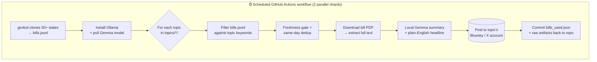

# 🏛️ govbot-social

**A free, multi-topic, multi-platform bot network that posts new U.S. state-legislative activity — each bill summarized in plain English by a local AI model — to Bluesky, X/Twitter, Threads, and Instagram.**

Powered by [chihacknight/govbot](https://github.com/chihacknight/govbot) for the raw legislative data and [Ollama](https://ollama.com/) + [Gemma](https://ai.google.dev/gemma) for on-runner summarization. Everything runs on scheduled **GitHub Actions** — no servers, no paid LLM API, no hosting bill.

<p align="left">
  
  
  
  
  
</p>

---

## Table of contents

- [What it does](#what-it-does)
- [Why it's different](#why-its-different)
- [The topics](#the-topics)
- [Architecture](#architecture)
- [How a post is made](#how-a-post-is-made)
- [Quick start](#quick-start)
- [Adding a new topic](#adding-a-new-topic)
- [The `config.yml` reference](#the-configyml-reference)
- [Configuration knobs](#configuration-knobs)
- [Local development](#local-development)
- [Workflows](#workflows)
- [Repository layout](#repository-layout)
- [State, dedup & seeding the backlog](#state-dedup--seeding-the-backlog)
- [Troubleshooting & gotchas](#troubleshooting--gotchas)
- [Contributing](#contributing)
- [Credits & license](#credits--license)

---

## What it does

Every day, a GitHub Actions workflow:

1. **Fetches** fresh bill activity from 50+ states and territories via `govbot`.
2. **Filters** it down per topic using a curated keyword model (with context and negative keywords to keep the feeds clean).
3. **Reads the actual bill** — it downloads each candidate bill's PDF and extracts the full statutory text so summaries are grounded in the real legislation, not just the title.
4. **Summarizes** each bill into one neutral, jargon-free sentence using a local Gemma model — *no third-party API, no key, no per-call cost*.
5. **Posts** it to the matching topic's Bluesky and/or X account with a rich link card pointing at the official legislature page.

A separate **weekly digest** workflow threads together the week's most significant actions per topic (bills signed into law, passed, vetoed, etc.).

Each **topic** is its own social account with its own keyword list, emoji map, summary focus, and independent dedup state — but every topic shares one workflow run, so adding a bot doesn't multiply your CI minutes.

## Why it's different

- 🆓 **Genuinely free to run.** No hosted server, no LLM API key. Summarization happens on the Actions runner with a local model. The whole thing fits in GitHub's free tier.
- 🧠 **Grounded summaries.** Most bill bots parrot the title. This one pulls the bill's PDF, extracts the full text with `pdftotext`, and asks the model to translate the *substance* into plain layman's terms — spelling out acronyms, swapping legalese ("appropriates" → "sets aside money for") for everyday words.
- 🧩 **Drop-in topics.** Adding a new subject area is three steps: create a folder, write a `config.yml`, add two secrets. The shared workflow auto-discovers it on the next run. No Python or YAML pipeline edits.
- 🐦 **Four platforms, one pipeline.** The same filtering/summarization engine drives Bluesky, X, Threads, and Instagram, with fully independent dedup state per platform.
- 🎯 **Quality filtering.** Title hits, multi-keyword body matches, context keywords, negative keywords, and per-bucket draws keep omnibus-budget noise and off-topic referenda out of the feeds.
- 📚 **Auditable.** Every posted bill's raw record and extracted full text is committed back to the repo, so there's a permanent trail of exactly what was posted and why.

## The topics

Thirteen topics ship out of the box, each its own account:

| Topic folder | Account focus |
| --- | --- |
| `ai_data_centers` | AI, Data Centers & Crypto |
| `criminal_justice` | Criminal Justice & Policing |
| `education` | Education |
| `elections_voting_rights` | Elections & Voting Rights |
| `environment_climate` | Environment & Climate |
| `healthcare` | Healthcare |
| `housing` | Housing |
| `immigration` | Immigration |
| `labor` | Labor & Workers' Rights |
| `lgbtq` | LGBTQ |
| `reproductive_rights` | Reproductive Rights |
| `taxation` | Taxation |
| `transportation` | Transportation |

Each folder is self-contained — its keywords, emoji rules, prompt focus, digest copy, and dedup state all live under `topics/<name>/`.

## Architecture



Two design choices make it cheap and scalable:

- **One fetch, many topics.** The slow `govbot` clone (~8 min) and the Ollama install/pull happen once per shard, then every topic reuses the same `bills.jsonl`. Topics are split across two parallel matrix shards (`index % 2`) that auto-rebalance as you add more.
- **Secrets by convention.** The workflow exposes `toJSON(secrets)` as a single `ALL_SECRETS` env var, and each script looks up `BLUESKY_HANDLE_<TOPIC>` at runtime. Adding a topic never requires touching the workflow file.

## How a post is made

For a single topic, `scripts/post_to_bluesky.py` (and its sibling `post_to_x.py`):

1. **Loads the topic** from `topics/<name>/config.yml` via `scripts/topic.py` (selected by the `BOT_TOPIC` env var).
2. **Filters** `bills.jsonl`:
   - A keyword in the **title** is a strong signal — one hit matches.
   - The noisier **abstract/subjects** body needs **two distinct** keyword hits (so a mental-health budget's lone "transportation" line item won't pull the bill into the transportation feed).
   - **`context_keywords`** (e.g. "human trafficking") only count when a core keyword co-occurs.
   - **`negative_keywords`** disqualify a title outright.
3. **Applies a freshness gate** — bill *actions* older than `MAX_ACTION_AGE_DAYS` are dropped so the feed never posts year-old news as fresh.
4. **Dedupes** against `topics/<name>/bills_used.json` (keyed by RSS `<guid>`, falling back to link, then a synthetic `feed_name:title` id).
5. **Draws** up to `POST_LIMIT` bills using a weighted random selection that spreads coverage across states (and across `keyword_groups` buckets where configured).
6. **Extracts the full bill text** from the bill's PDF (`scripts/bill_text.py` → `pdftotext`), degrading gracefully to abstract-only if the PDF or `pdftotext` is unavailable.
7. **Summarizes** via the local model — one neutral, plain-English sentence under ~160 characters, plus a short noun-phrase headline — picks a topical emoji, and composes a post that fits Bluesky's 300-grapheme limit.
8. **Posts** with a rich external link card to the official legislature page (with a state-homepage fallback when no deep link is known).
9. **Commits** the updated dedup state and raw artifacts back to the repo.

The **weekly digest** (`scripts/weekly_digest.py`) instead scores the week's actions by significance (signed → passed → vetoed → …), caps to `DIGEST_PER_STATE_CAP` bills per state to keep coverage broad, and posts a root summary plus up to `DIGEST_MAX_HIGHLIGHTS` threaded replies.

## Quick start

### 1. Use this repo as a template

Click **Use this template** on GitHub (or fork), then clone locally.

### 2. Generate a `govbot.yml`

Run `govbot` locally once with no config — it launches a wizard that writes `govbot.yml` (pick states and tags). Commit the result. To skip the wizard, see the [govbot docs](https://chihacknight.github.io/govbot/).

### 3. Create your social accounts and add secrets

In **Settings → Secrets and variables → Actions**, add credentials for each topic/platform you want live.

**Bluesky** — two secrets per topic:

| Secret | Value |
| --- | --- |
| `BLUESKY_HANDLE_<NAME>` | The topic's handle, e.g. `chn-transportation.bsky.social` |
| `BLUESKY_APP_PASSWORD_<NAME>` | An **app password** from Bluesky → *Settings → App Passwords* (never your main password) |

`<NAME>` is the **upper-case topic folder name**. So `topics/transportation/` → `BLUESKY_HANDLE_TRANSPORTATION` + `BLUESKY_APP_PASSWORD_TRANSPORTATION`; `topics/ai_data_centers/` → `BLUESKY_HANDLE_AI_DATA_CENTERS` + `BLUESKY_APP_PASSWORD_AI_DATA_CENTERS`.

**X/Twitter** — four developer-app secrets (shared by the X workflow):

| Secret | Value |
| --- | --- |
| `X_API_KEY` / `X_API_SECRET` | Your X app's consumer key & secret |
| `X_ACCESS_TOKEN` / `X_ACCESS_TOKEN_SECRET` | The posting account's access token & secret |

**Threads (Meta)** — a single dedicated account (e.g. `chn.govbot`), two secrets:

| Secret | Value |
| --- | --- |
| `THREADS_ACCESS_TOKEN` | A **long-lived** Threads access token (see below) |
| `THREADS_USER_ID` | The account's numeric Threads user id |
| `THREADS_REFRESH_PAT` | *(optional)* A PAT with `secrets: write` so the weekly refresh workflow can persist the rolled-forward token |

> **Getting the Threads token:** create a Meta app with the *"Access the Threads API"* use case, add the `threads_basic` + `threads_content_publish` permissions, add your Threads account under **App roles → Roles → Threads Testers** (and accept the invite inside Threads → *Settings → Website permissions*). Then generate a short-lived token in the **Graph API Explorer** and exchange it for a 60-day long-lived token via `GET https://graph.threads.net/access_token?grant_type=th_exchange_token&client_secret=…&access_token=…`. The `meta-threads-refresh-token` workflow keeps it from lapsing — see [Threads token refresh](#threads-token-refresh).

**Instagram (Meta)** — a single dedicated Instagram **Business/Creator** account, two secrets:

| Secret | Value |
| --- | --- |
| `INSTAGRAM_ACCESS_TOKEN` | A **long-lived** Instagram access token (see below) |
| `INSTAGRAM_USER_ID` | The Instagram **Business account** id |
| `INSTAGRAM_REFRESH_PAT` | *(optional)* A PAT with `secrets: write` so the weekly refresh workflow can persist the rolled-forward token |

> **Instagram is image-first.** Unlike the text platforms, Instagram's Graph API has no text-only post type and fetches the post image from a *public URL*. So the Instagram poster renders each bill into a 1080×1350 card (`scripts/render_bill_card.py`, dark mode, per-topic `card_accent`), commits + pushes it, waits for it to go live on `raw.githubusercontent.com`, then publishes via the two-step container→publish Graph call. The bill link can't be clickable in an Instagram caption, so it ships as plain text and the card footer reads *"Link to the bill in the description."* **This requires the repository to be public** so Instagram's servers can fetch the card.

> **Getting the Instagram token:** use the *Instagram API with Instagram Login* (`graph.instagram.com`). Create a Meta app, add the `instagram_business_basic` + `instagram_business_content_publish` permissions, connect your Instagram Business/Creator account, then exchange for a 60-day long-lived token. The `instagram-refresh-token` workflow keeps it from lapsing (same 60-day roll-forward model as Threads).

> Summarization runs entirely on the runner via a local Gemma model — **no OpenAI/Anthropic/other LLM API key is ever needed.**

### 4. Enable Actions

On the **Actions** tab, enable workflows. Trigger the first run manually via **Run workflow** on *govbot-bluesky-post*. (Read [Seeding the backlog](#state-dedup--seeding-the-backlog) first — the very first run treats *everything* as new.)

## Adding a new topic

The `topics/` layout exists so that adding a bot is a drop-in. The shared workflows already loop every folder under `topics/`, so once these steps are done the new bot goes live on the next run — **no Python or workflow edits required.**

1. **Create the folder** `topics/<name>/` and add a `config.yml` (copy `topics/transportation/config.yml` as a starting point). Fill in `keywords`, `emojis`, `prompt_topic`, and the `digest` copy.
2. **Add the secrets** in repo settings: `BLUESKY_HANDLE_<NAME>` / `BLUESKY_APP_PASSWORD_<NAME>` (and the X secrets if you run the X bot for it).
3. **Sync the dropdowns** so the manual workflows list your new topic:
   ```bash
   python scripts/sync_topic_choices.py
   ```
   This rewrites the managed `choice` option blocks in the `workflow_dispatch` YAMLs (they can't be populated dynamically at runtime).
4. **Dry-run** to preview before committing:
   ```bash
   BOT_TOPIC=<name> DRY_RUN=1 python scripts/post_to_bluesky.py
   ```
5. **Commit** the new folder. The next scheduled run picks it up.

## The `config.yml` reference

```yaml
name: transportation                # MUST match the folder name
display_name: "Transportation"      # Human label used in digest titles
prompt_topic: "transportation"      # Steers the LLM's summary focus
default_emoji: "🚗"                  # Fallback when no emoji rule matches

keywords:                           # Core match terms (word-boundary, case-insensitive)
  - transit
  - light rail
  - bike lane
  # ...

context_keywords:                   # (optional) only count when a core keyword co-occurs
  - safety

negative_keywords:                  # (optional) disqualify a title outright
  - referendum on liquor

emojis:                             # First matching rule wins; else default_emoji
  - emoji: "🚆"
    match: ["rail", "amtrak", "metra"]
  - emoji: "✈️"
    match: ["airport", "aviation"]

keyword_groups:                     # (optional) named buckets to balance the draw
  ai_data_centers: ["artificial intelligence", "data center"]
  crypto: ["cryptocurrency", "digital asset"]

x_subdir: x                         # (optional) X state subfolder; default "x"

digest:
  thread_title: "🗳️ Transportation Bills Weekly Digest"
  topic_phrase: "transportation"
```

| Field | Required | Purpose |
| --- | --- | --- |
| `name` | ✅ | Must equal the folder name (validated on load). |
| `keywords` | ✅ | Core match terms. |
| `display_name` / `prompt_topic` / `default_emoji` | — | Default to sensible values derived from `name`. |
| `context_keywords` | — | Broad terms that only match alongside a core keyword. |
| `negative_keywords` | — | Veto terms — a title hit drops the bill. |
| `emojis` | — | Ordered emoji rules (substring match over title+abstract+subjects). |
| `keyword_groups` | — | Named buckets so a multi-theme account (e.g. AI **and** crypto) posts at least one of each per run. First matching bucket wins. |
| `x_subdir` | — | Where X state lives under the topic (default `x`); override to rebrand a feed. |
| `digest` | — | `thread_title` and `topic_phrase` for the weekly thread. |

## Configuration knobs

All knobs are env vars (set defaults in the workflow `env:` blocks or override per-run):

| Variable | Default | What it controls |
| --- | --- | --- |
| `BOT_TOPIC` | — (required) | Which `topics/<name>/` folder this run posts for. |
| `POST_LIMIT` | `4` (workflows set `2`) | Max posts per run **per topic** — flood protection. |
| `MAX_ACTION_AGE_DAYS` | `32` (Bluesky), `62` (X) | Drop bill actions older than this so old news never posts as fresh. |
| `DRY_RUN` | `0` | `1` composes posts and prints them without publishing. State still updates so you can iterate. |
| `LLM_MODEL` | `gemma3:4b` | Ollama model. `gemma3:1b` = faster, `gemma3:12b` = richer (slower pull + latency). |
| `LLM_API_URL` | `http://localhost:11434/api/chat` | Ollama endpoint — point at any Ollama-compatible host. |
| `LLM_TIMEOUT` | `180` | Per-request timeout (seconds). |
| `FETCH_OG_IMAGE` | `0` | `1` re-enables scraping `og:image` thumbnails for link cards. |
| `SAVE_STATE` / `SAVE_RAW` | `1` / `1` | Toggle writing dedup state / raw artifacts (independent of `DRY_RUN`). |
| `FORCE_STATE` / `FORCE_BILL_ID` / `FORCE_REPOST` | — | Force-post one specific bill, bypassing the keyword/freshness/dedup gates (used by the *specific-bill* workflows). |
| `DIGEST_LOOKBACK_DAYS` | `7` | Weekly digest window. |
| `DIGEST_MAX_HIGHLIGHTS` | `6` | Max reply posts in a digest thread. |
| `DIGEST_PER_STATE_CAP` | `2` | Cap bills per state in a digest to keep it broad. |

The cron schedules live in the `on.schedule` block at the top of each workflow file (the daily posters default to early-morning UTC; the digests run weekly). Adjust them there.

## Local development

```bash
# 1. Install Ollama (https://ollama.com/) and pull the model
ollama pull gemma3:4b
#    Make sure `ollama serve` is running — the desktop app starts it
#    automatically; the Linux install script enables a systemd service.

# 2. (Optional) install poppler so full-text PDF extraction works
#    macOS:  brew install poppler      Debian/Ubuntu: apt-get install poppler-utils

# 3. Install Python deps and dry-run a topic
pip install -r requirements.txt
BOT_TOPIC=transportation DRY_RUN=1 python scripts/post_to_bluesky.py
```

A dry run prints the composed posts without hitting Bluesky/X. If Ollama isn't running, summaries fall back to the first clean sentence of the abstract (or are omitted) — the rest of the pipeline still works. If `pdftotext` is missing, full-text extraction is skipped and the model summarizes the abstract.

## Workflows

| Workflow | Trigger | What it does |
| --- | --- | --- |
| `post_to_bluesky.yml` | Daily cron + manual | Fetch → filter → summarize → post **all topics** to Bluesky. Sharded ×2. |
| `weekly-digest.yml` | Fridays + manual | Threaded weekly digest per topic on Bluesky. Sharded ×2. |
| `post_to_x.yml` | Daily cron + manual | Same pipeline, posting to an X account. |
| `weekly-digest-x.yml` | Weekly + manual | Weekly digest threads on X. |
| `post_to_meta_threads.yml` | Daily cron + manual | Same pipeline, posting to a Meta Threads account (dedicated to the `lgbtq` topic; 3 posts/run). |
| `weekly-digest-meta-threads.yml` | Fridays + manual | Weekly digest thread on Threads (root + a self-contained reply per highlight). |
| `meta-threads-refresh-token.yml` | Weekly + manual | Rolls the 60-day Threads token forward so it never lapses. |
| `post_to_instagram.yml` | Daily cron + manual | Renders each bill to a card image, pushes it, then posts to a Meta Instagram Business account (dedicated to the `lgbtq` topic; 2 posts/run). |
| `instagram-refresh-token.yml` | Weekly + manual | Rolls the 60-day Instagram token forward so it never lapses. |
| `post_bluesky_specific_bill.yml` | Manual | Force-post one specific `state` + `bill_id` to a chosen topic's Bluesky account (with dry-run / repost toggles). |
| `post_x_specific_bill.yml` | Manual | Same one-off force-post, for X. |
| `collect-samples.yml` | Manual | Save a batch of full bill records into `samples/` (optionally compose/post them too). Useful for prompt-tuning and tests. |

All scheduled workflows start with a **free-disk-space** step — `govbot` cloning 50+ states plus the Ollama model would otherwise overflow the runner's ~14 GB and crash with *"No space left on device."* Ollama's binary and model are cached between runs to skip the ~600 MB + ~3.3 GB downloads.

## Repository layout

```
.github/workflows/
  post_to_bluesky.yml          # daily Bluesky pipeline (all topics, sharded)
  post_to_x.yml                # daily X pipeline
  weekly-digest.yml            # Friday Bluesky digest threads
  weekly-digest-x.yml          # X digest threads
  post_bluesky_specific_bill.yml  # manual one-off force-post (Bluesky)
  post_x_specific_bill.yml        # manual one-off force-post (X)
  collect-samples.yml          # save sample bill records to samples/
scripts/
  topic.py                     # Topic config loader + matching/emoji logic
  post_to_bluesky.py           # shared Bluesky bot (parameterized by BOT_TOPIC)
  post_to_x.py                 # shared X bot (reuses the Bluesky engine)
  post_to_meta_threads.py      # shared Threads bot (reuses the Bluesky engine)
  post_to_instagram.py         # shared Instagram bot (renders + posts card images)
  render_bill_card.py          # Pillow renderer for the Instagram bill cards
  weekly_digest.py             # Bluesky weekly digest builder
  weekly_digest_x.py           # X weekly digest builder
  weekly_digest_meta_threads.py # Threads weekly digest builder
  bill_text.py                 # full bill-text extraction from PDFs (pdftotext)
  refresh_meta_threads_token.py # roll the Threads long-lived token forward
  refresh_instagram_token.py   # roll the Instagram long-lived token forward
  sync_topic_choices.py        # keep workflow choice dropdowns in sync with topics/
samples/                       # saved bill records for prompt-tuning / tests
topics/
  <name>/
    config.yml                 # keywords, emojis, prompt focus, digest copy
    bills_used.json            # per-topic Bluesky dedup state (committed)
    bills_raw/                 # raw JSON of each posted bill (audit trail)
    bills_full_text/           # extracted full text of each posted bill
    weekly_digest/             # digest highlight artifacts
    x/  (or x_subdir)          # mirror of the above for the X account
    meta-threads/ (or threads_subdir) # mirror of the above for the Threads account
    instagram/ (or instagram_subdir)  # mirror for Instagram, plus cards/ (rendered PNGs)
requirements.txt               # requests, Pillow, PyYAML, tweepy
```

## State, dedup & seeding the backlog

- **Idempotency** is per-platform and per-topic. Bluesky dedup lives in `topics/<name>/bills_used.json`; X dedup under `topics/<name>/<x_subdir>/bills_used.json`; Threads dedup under `topics/<name>/<threads_subdir>/bills_used.json`; Instagram dedup under `topics/<name>/<instagram_subdir>/bills_used.json`. Keys are the RSS `<guid>` (falling back to link, then `feed_name:title`).
- **First run is loud.** With an empty state file, *every* matching bill is "new." Each topic ships with `{"posted": []}`, and `POST_LIMIT` caps the blast radius — but you'll likely want to seed the backlog first.
- **Permissions.** Posting workflows need `contents: write` to commit state back. This is set in the workflows, but org-level settings can override it — check **Settings → Actions → General → Workflow permissions** if commits aren't landing.

### Seed a topic to skip the backlog

After running `govbot logs > bills.jsonl` once, mark everything currently in the feed as "already posted" so the bot only flags genuinely new activity from then on:

```bash
BOT_TOPIC=transportation python -c "
import json, sys
sys.path.insert(0, 'scripts')
from post_to_bluesky import TOPIC, JSONL_PATH, load_bills, extract_fields
keys = []
for r in load_bills(JSONL_PATH):
    b = extract_fields(r)
    if b and TOPIC.matches(b):
        keys.append(b['dedup_key'])
out = TOPIC.state_file_path()
out.parent.mkdir(parents=True, exist_ok=True)
out.write_text(json.dumps({'posted': sorted(set(keys))}, indent=2))
print(f'Seeded {len(set(keys))} dedup keys into {out}.')
"
git add topics/transportation/bills_used.json
git commit -m "seed transportation backlog" && git push
```

Repeat with `BOT_TOPIC=<name>` for each topic before enabling its workflow.

### Threads token refresh

Threads access tokens differ from Bluesky app passwords: a long-lived token is valid for **60 days**, but can be *refreshed* (which rolls the 60-day window forward) any time after it's 24 hours old. The `meta-threads-refresh-token.yml` workflow does this on a weekly cron via `scripts/refresh_meta_threads_token.py`, so the token never lapses as long as the bot keeps running.

Persisting a refreshed token means updating the `THREADS_ACCESS_TOKEN` repo secret, which the default `GITHUB_TOKEN` can't do. To enable automatic write-back, add a **`THREADS_REFRESH_PAT`** secret — a Personal Access Token with `secrets: write` on this repo. The refresh script encrypts the new token (via PyNaCl) and writes it back through the GitHub API. Without the PAT, the workflow still refreshes and reports the new expiry but won't persist the token (and never prints it to the logs).

## Troubleshooting & gotchas

- **A state was skipped in the logs.** `govbot` panics on states it doesn't support; the workflow wraps each clone in `|| echo skipped` and prints a *supported vs skipped* summary at the end. That's expected, not an error.
- **Summaries look thin / generic.** Make sure `poppler-utils` is installed so full-text extraction runs — without it the model only sees the abstract. Bumping `LLM_MODEL` to `gemma3:12b` also helps (at a latency cost).
- **Nothing posted but no error.** Check `POST_LIMIT`, the freshness window (`MAX_ACTION_AGE_DAYS`), and whether the bills were already in `bills_used.json`.
- **New topic missing from the manual workflow dropdown.** Run `python scripts/sync_topic_choices.py` and commit the updated YAMLs.
- **Runner crashed with "No space left on device."** The free-disk-space step must run before the govbot clone; don't remove it.
- **Threads: `"requires the threads_basic permission … or your user must be in the list of Threads testers."`** The account isn't enrolled as a tester. Add it under **App roles → Roles → Threads Testers**, accept the invite in Threads (*Settings → Website permissions*), then regenerate the token.
- **Threads posts stopped after ~2 months.** The long-lived token expired. Make sure `meta-threads-refresh-token.yml` is enabled (and ideally set `THREADS_REFRESH_PAT`), or re-run the manual token exchange.

## Contributing

Issues and PRs welcome — new topics, better keyword models, additional state deep-link builders, and prompt improvements are all great contributions. To propose a new topic, open a PR adding `topics/<name>/config.yml` and run `sync_topic_choices.py`. Use the `samples/` records and `DRY_RUN=1` to validate filtering and summaries before publishing.

## Credits & license

- Legislative data: [chihacknight/govbot](https://github.com/chihacknight/govbot) (Chi Hack Night).
- Summarization: [Gemma](https://ai.google.dev/gemma) served locally by [Ollama](https://ollama.com/).
- Full-text extraction inspired by upstream [govbot#31](https://github.com/chihacknight/govbot/issues/31).

Released under the **MIT License** — do whatever, just keep people informed.
